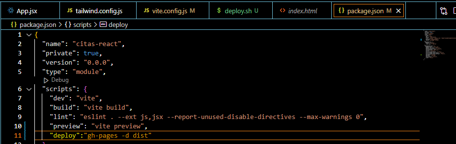
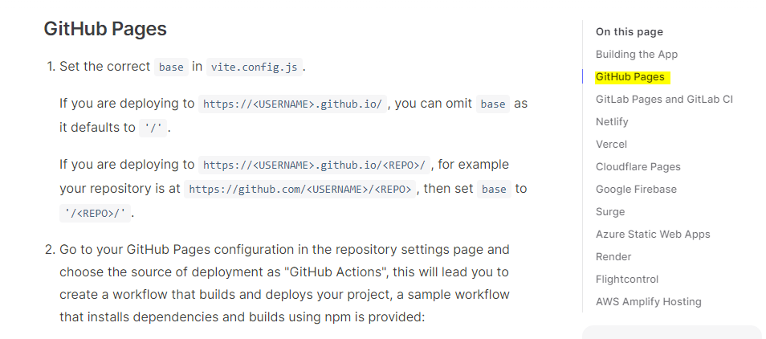
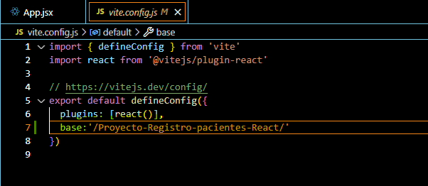

# Pasos para hacer el despliegue con github pages.

1) compilar el proyecto:
    npm run build

2) Instalar gh-pages-npm
   npm install gh-pages --save-dev

3) En el archivo package.json en la sección dee Scripts colocar:
 "deploy" : "gh-pages -d"
 
 

 4) Ir al sitio web de vite: https://vitejs.dev/guide/static-deploy.html#github-pages  e ir a la sección de GitHub Pages
y seguir las instrucciones especificadas.

 

 5) En el archivo vite.config.js colocar  en el objeto export default defineConfig
el nombre del repositorio '/REPO/'



6) Crear un archivo deploy.sh en la carpeta src y pegar el siguiente codigo:

```
#!/usr/bin/env sh

# abort on errors
set -e

# build
npm run build

# navigate into the build output directory
cd dist

# place .nojekyll to bypass Jekyll processing
echo > .nojekyll

# if you are deploying to a custom domain
# echo 'www.example.com' > CNAME

git init
git checkout -B main
git add -A
git commit -m 'deploy'

# if you are deploying to https://<USERNAME>.github.io
# git push -f git@github.com:<USERNAME>/<USERNAME>.github.io.git main

# if you are deploying to https://<USERNAME>.github.io/<REPO>
git push -f git@github.com:Yohander20/Proyecto-Registro-pacientes-React.git main:gh-pages

cd -

```
`Nota: Actualizar el repositorio en la instrucción de git push donde se va a desplegar el proyecto.`

7) Correr el comando npm run build

8) Correr el comando npm run deploy

